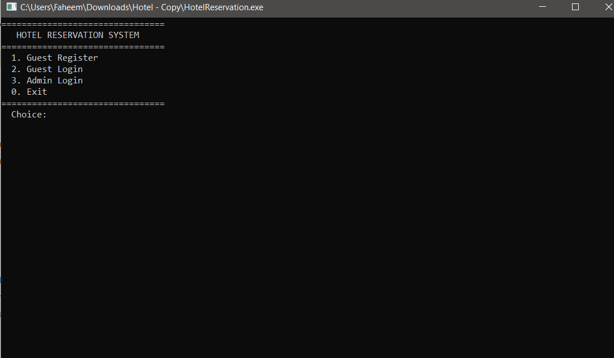
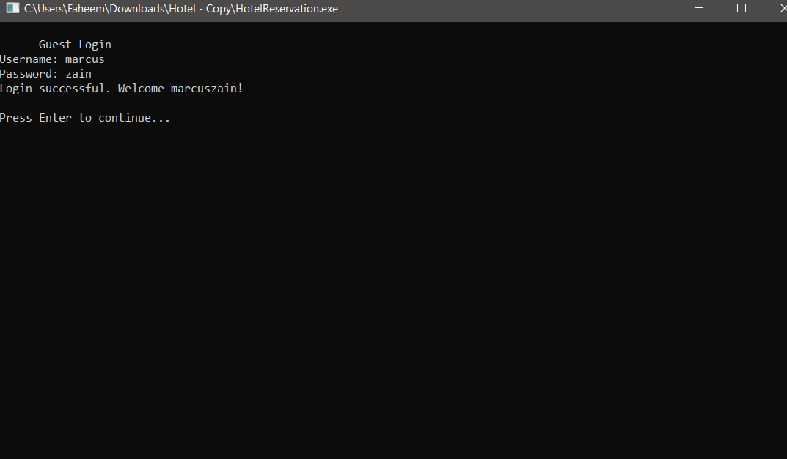
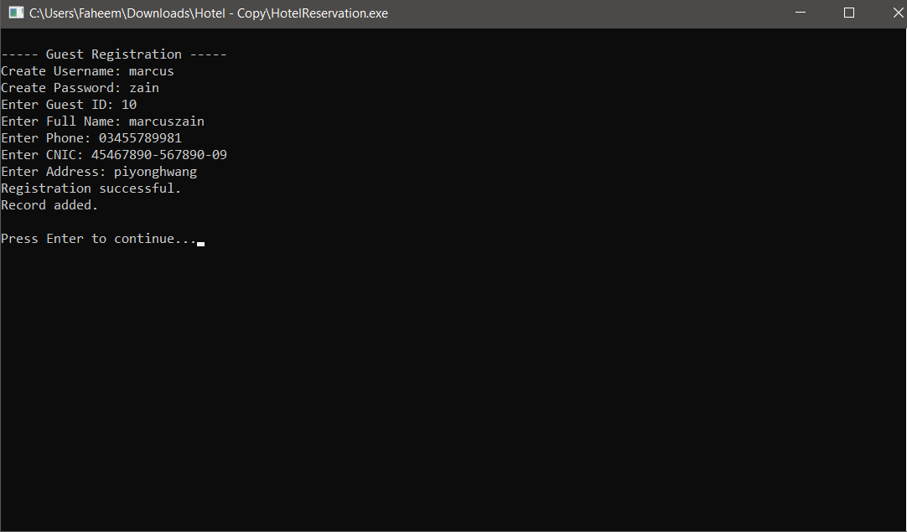
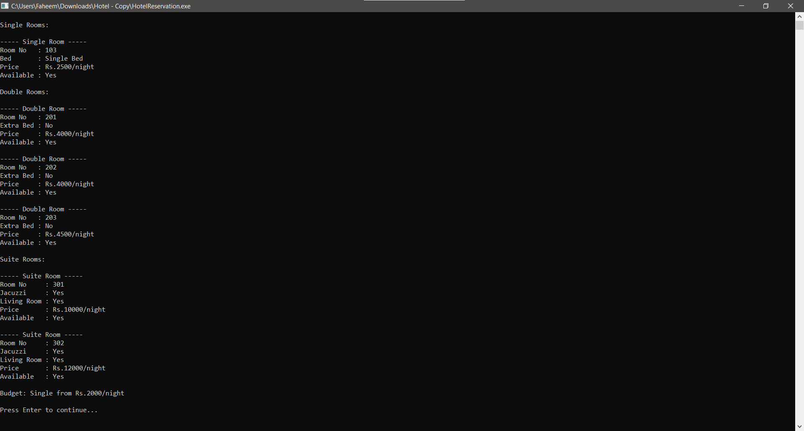
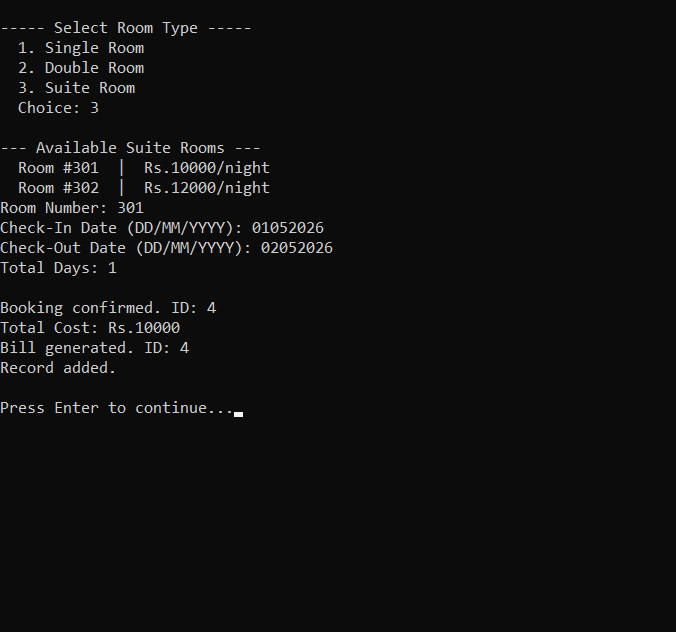
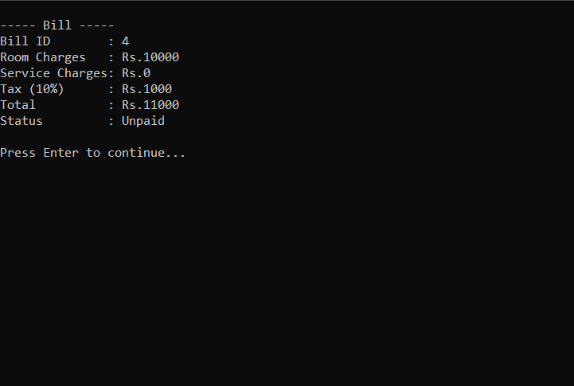
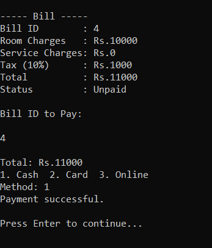
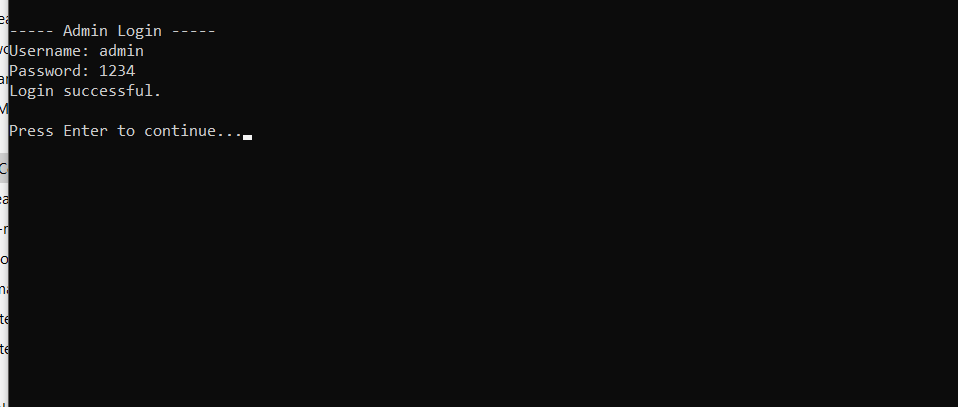
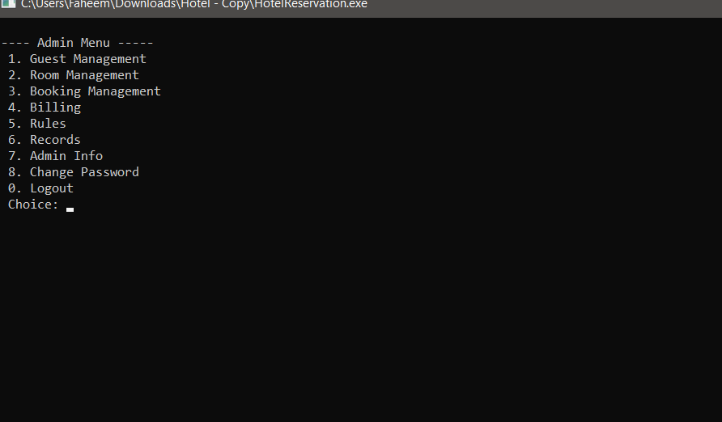

# 🏨 Hotel Reservation System

> A console-based Hotel Reservation System built in C++ using 
> Object-Oriented Programming principles.


---

## Table of Contents

- [About](#about)
- [Screenshots](#screenshots)
- [Features](#features)
- [OOP Concepts](#oop-concepts)
- [Project Structure](#project-structure)
- [How to Run](#how-to-run)
- [How to Use](#how-to-use)
- [Default Data](#default-data)
- [Technical Details](#technical-details)
- [Authors](#authors)

---

## 📖 About

This project is a **Hotel Reservation System** developed in **C++** 
as a Complex Computing Activity (CCA) for the Object-Oriented 
Programming course. The system simulates real-world hotel operations 
including guest management, room booking, billing, and administrative 
control with full data persistence across sessions.

The system demonstrates the following OOP concepts practically:
- Encapsulation, Inheritance, Polymorphism, Abstraction
- Composition, Aggregation, Friend Functions
- Operator Overloading, File Handling, Exception Handling, STL

---
## Screenshots

### Main Screen


### Guest Login + Welcome


### Guest Registration


### View Available Rooms


### Book a Room


### View Bill


### Pay Bill


### Admin Login


### Admin Menu


### Admin View All Rooms
.png)

### Admin All Bill
.png)

### Data Persistence


## ✨ Features

### 👤 Guest Portal
| Feature | Description |
|---------|-------------|
| Register | Create account with username and password |
| Login | Secure login with credentials |
| View Rooms | Browse available rooms with prices and details |
| Book Room | Select room type, view available rooms, confirm booking |
| View Bookings | See all personal booking history |
| View Bills | Check bill details with tax breakdown |
| Pay Bill | Pay using Cash, Card, or Online |
| Update Info | Edit personal information |
| Hotel Policies | View hotel rules and policies |

### 🔐 Admin Portal
| Feature | Description |
|---------|-------------|
| Secure Login | Protected admin access |
| Guest Management | View, search, and delete guests |
| Room Management | View all rooms, add new rooms |
| Booking Management | Check in, check out, cancel bookings |
| Billing | View bills, apply discounts, view detailed bills |
| Rules Management | Add, update, and view hotel rules |
| Records | View activity logs and generate reports |
| Change Password | Update admin credentials |

---

## 🧠 OOP Concepts

### Core OOP (5 Credits)

| Concept | Implementation |
|---------|---------------|
| **Encapsulation** | All attributes private/protected with public getters and setters. Password has no getter for security. |
| **Inheritance** | Person → Admin, Guest (Single). Room → SingleRoom, DoubleRoom, SuiteRoom (Hierarchical) |
| **Runtime Polymorphism** | displayInfo() virtual in Person, overridden in Admin and Guest. displayRoomInfo() virtual in Room, overridden in all room types |
| **Abstraction** | Person and Room are abstract classes with pure virtual functions. Cannot be instantiated directly |
| **Composition** | HotelSystem owns Admin, FileManager, and Records as member objects |
| **Aggregation** | HotelSystem has arrays of Guest, Rooms, Booking, Billing, Rules |
| **Friend Functions** | generateFinalBill() accesses private data of both Booking and Billing |
| **Constructors** | Default and Parameterized constructors in all 14 classes |
| **Destructors** | Virtual destructors with static counter management |

### Additional Requirements (5 Credits)

| Feature | Marks | Status | Implementation |
|---------|-------|--------|---------------|
| File Handling | 1 | ✅ Done | 5 text files for persistent storage |
| Exception Handling | 1 | ✅ Done | Custom HotelException class |
| STL Usage | 1 | ✅ Done | vector<string> in Records class |
| GUI Implementation | 1 | ⬜ Future | Console-based currently |
| Database Connectivity | 1 | ⬜ Future | Text files used currently |

## 📁 Project Structure

## Project Structure

| Sr. No. | File Name | Purpose |
|--------|-----------|---------|
| 1 | `main.cpp` | Driver program / entry point |
| 2 | `Person.h` | Person class declaration |
| 3 | `Person.cpp` | Person class implementation |
| 4 | `Admin.h` | Admin class declaration |
| 5 | `Admin.cpp` | Admin class implementation |
| 6 | `Guest.h` | Guest class declaration |
| 7 | `Guest.cpp` | Guest class implementation |
| 8 | `Room.h` | Room abstract class declaration |
| 9 | `Room.cpp` | Room abstract class implementation |
| 10 | `SingleRoom.h` | SingleRoom class declaration |
| 11 | `SingleRoom.cpp` | SingleRoom class implementation |
| 12 | `DoubleRoom.h` | DoubleRoom class declaration |
| 13 | `DoubleRoom.cpp` | DoubleRoom class implementation |
| 14 | `SuiteRoom.h` | SuiteRoom class declaration |
| 15 | `SuiteRoom.cpp` | SuiteRoom class implementation |
| 16 | `Booking.h` | Booking class declaration |
| 17 | `Booking.cpp` | Booking class implementation |
| 18 | `Billing.h` | Billing class declaration |
| 19 | `Billing.cpp` | Billing class implementation |
| 20 | `Records.h` | Records class declaration |
| 21 | `Records.cpp` | Records class implementation |
| 22 | `FileManager.h` | FileManager class declaration |
| 23 | `FileManager.cpp` | FileManager class implementation |
| 24 | `Rules.h` | Rules class declaration |
| 25 | `Rules.cpp` | Rules class implementation |
| 26 | `HotelException.h` | Exception class declaration |

| 27 | `HotelException.cpp` | Exception class implementation |
| 28 | `HotelSystem.h` | HotelSystem class declaration |
| 29 | `HotelSystem.cpp` | HotelSystem class implementation |
| 30 | `guests.txt` | Stores guest data |
| 31 | `rooms.txt` | Stores room data |
| 32 | `bookings.txt` | Stores booking data |
| 33 | `bills.txt` | Stores billing data |
| 34 | `rules.txt` | Stores rules and policies |

### Folder Representation

| Folder / File Structure |
|-------------------------|
| `HotelReservationSystem/` |
| `├── main.cpp` |
| `├── Person.h` |
| `├── Person.cpp` |
| `├── Admin.h` |
| `├── Admin.cpp` |
| `├── Guest.h` |
| `├── Guest.cpp` |
| `├── Room.h` |
| `├── Room.cpp` |
| `├── SingleRoom.h` |
| `├── SingleRoom.cpp` |
| `├── DoubleRoom.h` |
| `├── DoubleRoom.cpp` |
| `├── SuiteRoom.h` |
| `├── SuiteRoom.cpp` |
| `├── Booking.h` |
| `├── Booking.cpp` |
| `├── Billing.h` |
| `├── Billing.cpp` |
| `├── Records.h` |
| `├── Records.cpp` |
| `├── FileManager.h` |
| `├── FileManager.cpp` |
| `├── Rules.h` |
| `├── Rules.cpp` |
| `├── HotelException.h` |
| `├── HotelException.cpp` |
| `├── HotelSystem.h` |
| `├── HotelSystem.cpp` |
| `├── guests.txt` |
| `├── rooms.txt` |
| `├── bookings.txt` |
| `├── bills.txt` |
| `└── rules.txt` |


---
## 🚀 How to Run

### Option 1: Dev-C++ (Recommended for beginners)
Open Dev-C++
File → New → Project → Console Application → C++
Project → Add to Project → select all .h and .cpp files
Execute → Compile and Run (F11)


### Option 2: Command Line (g++)

```bash
g++ main.cpp Person.cpp Admin.cpp Guest.cpp \
    Room.cpp SingleRoom.cpp DoubleRoom.cpp SuiteRoom.cpp \
    Booking.cpp Billing.cpp Records.cpp FileManager.cpp \
    Rules.cpp HotelException.cpp HotelSystem.cpp \
    -o HotelReservation

Windows:
HotelReservation.exe

Linux / Mac:
./HotelReservation

1. Install C/C++ extension
2. Open project folder
3. Terminal → New Terminal
4. Run g++ command above
5. Run the executable

📖 How to Use
As a Guest
Step 1: Select "1. Guest Register"
        → Create username and password
        → Enter your details

Step 2: Select "2. Guest Login"
        → Enter your username and password

Step 3: Select "2. View Available Rooms"
        → See all available rooms with prices

Step 4: Select "3. Book a Room"
        → Choose room type (Single/Double/Suite)
        → Available rooms with prices will be shown
        → Enter room number from the list
        → Enter check-in date, check-out date, total days
        → Booking confirmed, bill auto-generated

Step 5: Select "5. View My Bills"
        → See your bill with tax breakdown

Step 6: Select "6. Pay Bill"
        → Your bills will be shown
        → Enter Bill ID
        → Choose payment method

As Admin
Step 1: Select "3. Admin Login"
        Username: admin
        Password: 1234

Step 2: Navigate menus:
        1 → Guest Management
        2 → Room Management
        3 → Booking Management
        4 → Billing
        5 → Rules
        6 → Records

📊 Default Data
Default Admin Credentials
Field	Value
Username	admin
Password	1234
Default Rooms
Room No	Type	Price/Night	Features
101	Single	Rs. 2,000	Single Bed
102	Single	Rs. 2,000	Single Bed
103	Single	Rs. 2,500	Single Bed
201	Double	Rs. 4,000	Double Bed
202	Double	Rs. 4,000	Double Bed
203	Double	Rs. 4,500	Double Bed
301	Suite	Rs. 10,000	Jacuzzi + Living Room
302	Suite	Rs. 12,000	Jacuzzi + Living Room
Data Files (Auto Generated)
File	Contents
guests.txt	Guest accounts and credentials
rooms.txt	Room inventory and availability
bookings.txt	All booking records
bills.txt	All billing records
rules.txt	Hotel rules
Note: All data files are automatically created when first needed.
No manual setup required.

🔧 Technical Details
Detail	Value
Language	C++
Standard	C++11 or later
Interface	Console based
Storage	Text files (.txt)
Compiler	GCC / TDM-GCC 64-bit
IDE	Dev-C++ / VS Code / CLion
Platform	Windows / Linux / Mac
Classes	15
Files	29 source + 5 data


🔄 System Flow
Person (Abstract)
├── Admin
└── Guest

Room (Abstract)
├── SingleRoom
├── DoubleRoom
└── SuiteRoom

HotelSystem
├── owns: Admin, FileManager, Records
└── has:  Guest[], Rooms[], Booking[], Billing[], Rules[]

Program Start
     │
     ├── Guest Register ──► Save to guests.txt
     │
     ├── Guest Login ──► Load from guests.txt
     │       │
     │       ├── View Available Rooms
     │       ├── Book Room ──► Save booking + bill
     │       ├── View Bills
     │       └── Pay Bill ──► Update bill status
     │
     └── Admin Login
             │
             ├── Manage Guests
             ├── Manage Rooms ──► Save to rooms.txt
             ├── Check In / Check Out
             ├── Apply Discount
             └── View Records


### Data Persistence
[Data Persistence Video](screenshots/DataPersistence.mp4)

🐛 Known Issues
Date format is not validated automatically
Total days must be entered manually
Passwords are stored as plain text
No session timeout implemented

🔮 Future Enhancements
 GUI using Qt framework
 Database integration with SQLite
 Password encryption
 Automatic date validation and day calculation
 Email and SMS notifications
 Multi-branch hotel support
 Online booking portal
 Analytics dashboard
 Loyalty points system


👥 Authors
Name	Roll Number	Contribution
[Anus]	[127]	Person, Admin, Guest classes, UML
[Shehroz Ali Khan]	[143]	Room classes, Booking, Billing, File handling
[Mukkaram Adil]	[138]	HotelSystem, Records, Rules, Testing, Report

📄 License
This project is developed for educational purposes only as part of
an academic assignment. Not intended for commercial use.

🙏 Acknowledgements
Course instructor for guidance and support
C++ documentation at cppreference.com
PlantUML for UML diagram generation

GeeksforGeeks for OOP concept references
Codewithharry for OOP concept references

Developed with ❤️ using C++ OOP principles


